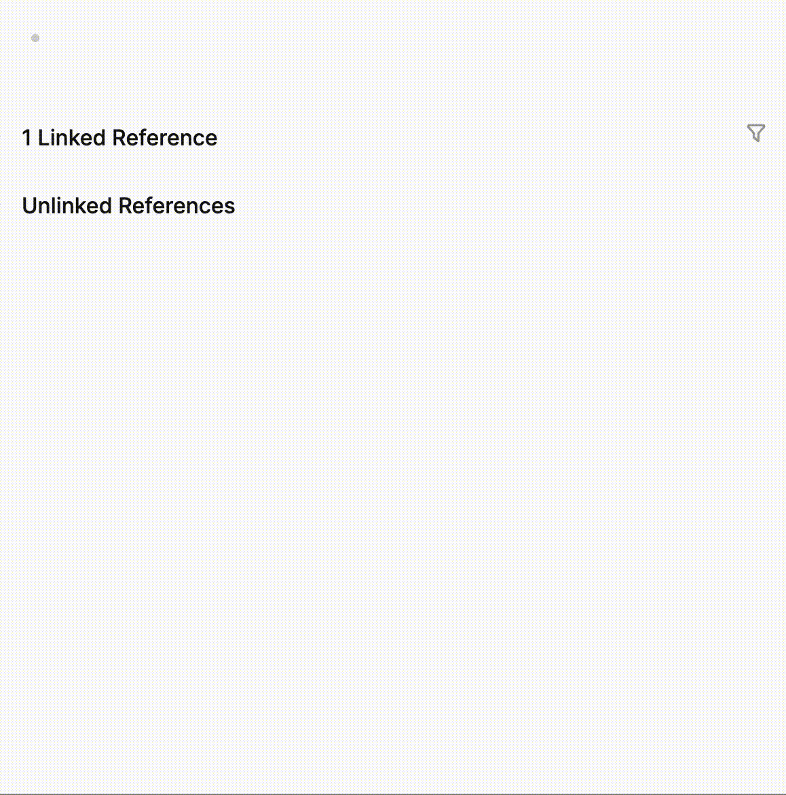

# logseq-mermaid-plugin
  

> Create Mermaid diagrams in image format on-the-fly and save them.

---

## ✨ Features
- **Static Image Generation**: Renders Mermaid diagrams as standard PNG images directly in your blocks, ensuring they are portable and easy to export.
- **High Resolution**: Configurable scaling factor (default 3x) ensures your diagrams look crisp on all displays.
- **Theme Aware**: Automatically detects your Logseq theme (Light/Dark) and adjusts the Mermaid colors to match.
- **Easy Export**: Because diagrams are rendered as standard images, you can simply right-click and "Save Image As" to use them elsewhere.

## 📸 Screenshots / Demo

## ⚙️ Installation
1. Open Logseq.
2. Go to the **Marketplace** (Plugins > Marketplace).
3. Search for **logseq-mermaid-plugin**.
4. Click **Install**.

## 🛠 Usage & Settings
1. Type `/Draw mermaid diagram`.
2. Modify the renderer with the desired scaling factor (default is 3).
   * Example: `{{renderer :mermaid_66b0fcff-ea9e-4909-9aab-554186001e73, 3}}`
   * Increasing the number increases the image resolution.
3. Enter your mermaid code into the code block.

#### ⚠️ Known Limitations
To enable "Save as Image" functionality, this plugin converts the raw SVG into a standard PNG. Browser security restrictions prevent this conversion if the SVG contains HTML code (known as `foreignObject` tags).

The following diagram types rely on `foreignObject` and will not render with this plugin:
- ❌ Mindmaps
- ❌ Timelines
- ❌ Class Diagrams (if they use complex text wrapping)
- ❌ Flowcharts using HTML labels (e.g., `<b>Bold Text</b>`)

## ☕️ Support
If you enjoy this plugin, please consider supporting the development!

  &nbsp;

## 🤝 Contributing
Issues are welcome. If you find a bug, please open an issue. Pull requests are not accepted at the moment as I am not able to commit to reviewing them in a timely fashion.

## ❤️ Credits
- [Mermaid.js](https://mermaid.js.org/) for the incredible diagramming and charting tool.
